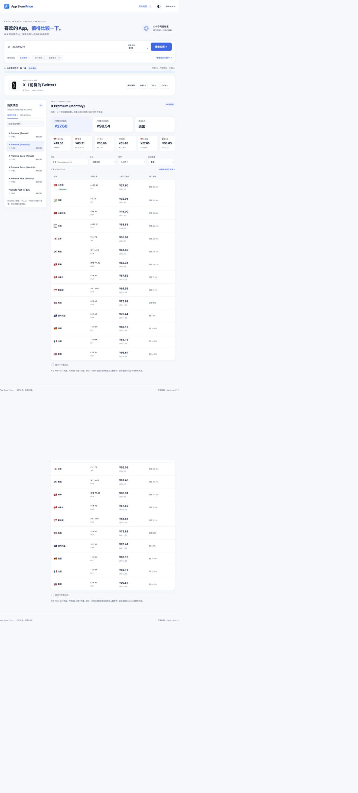
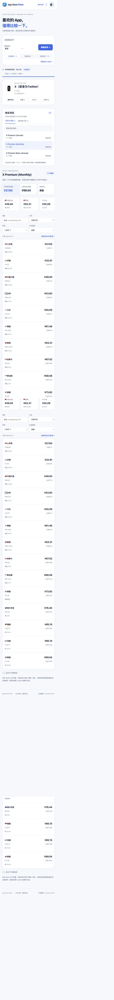

# App Store 全球价格比较器

[](https://github.com/wwm9213/app-store-price/actions/workflows/check.yml)

[源代码](https://github.com/wwm9213/app-store-price) · [构建记录与 JAR](https://github.com/wwm9213/app-store-price/actions/workflows/check.yml) · [问题反馈](https://github.com/wwm9213/app-store-price/issues)

比较 Apple App Store **175 个实际 storefront** 的应用本体和公开内购价格。输入应用名称、App ID 或 App Store 链接，结果通过 SSE 陆续展示。默认仅查询 **14 个主流地区**，可切换保存的地区或手动查询全部 175 区。Java 21 / Spring Boot 4.1 / Alpine.js，无数据库、Redis 或 Apple 开发者账号要求。

## 使用

- 首页输入为空，不预填或自动查询示例 App。名称搜索始终先展示候选，核对图标、描述和 App ID 后手动选择；URL / ID 直接查询。
- 主流地区为 US、CN、HK、TW、JP、KR、SG、TR、IN、GB、CA、AU、DE、FR。只有主动选择“全部地区”才发起全量查询。
- “我的地区”及范围偏好保存在浏览器 localStorage；可搜索选择、保存和清空。查询完整快照按 App ID + 地区集合缓存 6 小时，最多 5 条、合计 180 万个 JSON 字符；从最早观测时间起算，避免旧价格重新获得完整有效期。管理面板可单独清除查询缓存，保留地区偏好。
- “购买项目”仅整理当前选定 App：同名项目合并为一个入口，创作者订阅单独分类，列表支持搜索和固定高度滚动；同区多档报价可展开查看，不抹去原始身份。
- 搜索应用、首次等待应用信息时显示页面 loading，可取消等待；结果开始返回后按地区渐进展示。
- 搜索商店、分区、排序、比较基准四个下拉菜单均可输入模糊筛选；地区支持中文、英文与地区代码，支持方向键、回车选择及 Esc 关闭。
- 切换软件本体或内购项目，查看原币、人民币、美元和基准地区差价。
- 支持我的地区、分区、中英文地区搜索、排序、失败重试、手机卡片及明暗主题。
- `/?appId=<APP_ID>` 分享查询；分享按钮还会附带 `areas=us,cn,...`，保留本次范围且不覆盖接收者的地区偏好；CSV / JSON 导出完整当前快照，查询中导出明确标记 `partial`。
- 排名始终写作“已获取最低 / 最高”，同时显示项目覆盖与全局查询进度。



<details><summary>手机界面</summary>



</details>

## 数据边界

价格来自对应 [Apple 公开页面](https://apps.apple.com/us/app/id1546947240)，地区清单来自页面地区选择器。当前配置核实日期为 **2026-09-16**，175 区、43 种币种，包括 Apple 使用的 `xk`。地区身份来自请求 storefront，不能由 USD、EUR 等币种反推。

公开网页不一定列出完整 IAP / 订阅目录；未列出不代表不可购买。商品类型、自动续订属性和周期无明确字段时保持未知。缺失或无法解析的价格不会填成零；明确免费才记零。单项内购解析失败会保留其他项目及问题说明。

商品匹配规则：

1. 可靠商品 ID 优先，状态为 `EXACT`。
2. 没有 ID 时，使用唯一名称；需要跨语言匹配时，补抓**同一 storefront** 的英文页，仅在数量、唯一金额对应关系及已知属性一致时建立别名。
3. 跨区唯一名称且无冲突的结果标记 `INFERRED`；同名多商品、重复金额或属性冲突保持独立并标记 `MATCH_UNCERTAIN`。不按跨区价格接近程度或列表位置对齐。

展示层按标准化名称折叠入口，不跨应用合并。身份未确认或含多个商品的同名汇总展示地区报价范围，禁用跨档排名和基准差价；类型、周期或可靠商品 ID 不同的报价仍单独保留。导出使用原始快照，不因界面去重而删掉记录。

每条价格保留原名、原币金额、币种、原始文本、来源 URL、抓取时间、汇率日期和匹配依据。原始字段在 JSON 中完整保留；CSV 包含价格记录和所有已返回地区的状态记录、错误、覆盖情况与查询完成标记。未完成地区尚无观测值，不能视为不可售。

汇率使用 [Currency API](https://github.com/fawazahmed0/exchange-api)（CC0，每日更新），默认 USD 快照来自 jsDelivr，备用为 `currency-api.pages.dev`。一次查询固定同一份汇率；新查询可对缓存当地价格重新换算。刷新失败使用最近成功快照，首次无汇率仍展示当地价格。汇率日期以响应为准，通常不是查询当天。基准价缺失或为零不计算百分比；至少 5 个正价样本时，低于中位数四分之一标记异常低价，仍保留记录。

## 连接 GitHub 自动部署

本仓库提供 Render 部署配置，保留名称搜索、任意 App ID 实时查询及 SSE 进度，无需自行维护服务器。

[](https://render.com/deploy?repo=https://github.com/wwm9213/app-store-price)

1. 点击按钮并登录 Render，连接有权访问本仓库的 GitHub 账号。为自己的部署建议 Fork 后修改按钮中的仓库地址，以免跟随其他维护者的提交自动更新。
2. 使用仓库中的 `render.yaml` 创建 Web Service，确认 **Free**、Docker、`main` 分支、新加坡地区；不需要数据库或磁盘。
3. 首次构建成功后，使用 Render 实际分配的 `https://…onrender.com` 地址访问。健康检查路径为 `/api/v2/storefronts`。
4. 后续推送到 `main`，GitHub CI 检查通过后，Render 才自动部署（`autoDeployTrigger: checksPass`）。通过“Git Provider”连接仓库才能自动更新；仅填写 Public Git Repository URL 的服务需要手动部署。

`render.yaml` 默认限制 JVM 堆占容器内存的 50%，抓取并发及同时查询数均为 4，以适配免费实例；普通 Docker / Java 运行仍采用前文默认配置。平台会自动配置 HTTPS。

Free 实例闲置 15 分钟会休眠，下一次访问可能等待约一分钟；重启会清空服务端内存及本地汇率缓存，浏览器中保存的地区和快照不受影响。免费实例有运行时间、流量与构建配额限制，适合个人试用；不附加付费数据库、磁盘或其他服务。[免费实例限制](https://render.com/docs/free)

登录、GitHub 授权和首次创建服务需要在你的 Render 账号中完成；提供部署配置或发布镜像，不代表已经获得在线访问地址。

## GitHub 构建与镜像发布

推送到 `main` 后，`check` 工作流依次执行：

1. Java 21 / Maven 测试与 JAR 打包、Node 前端测试。
2. 从源码构建 Docker 镜像，启动容器并回读首页和地区 API。
3. 检查通过后发布 `linux/amd64`、`linux/arm64` 镜像到 `ghcr.io/wwm9213/app-store-price`，包含 `latest` 与 `sha-<完整提交号>` 标签。

JAR 可从成功构建的 Artifacts 下载，保留 14 天。镜像支持按提交号或 digest 固定版本，便于追溯和回滚。原有 `release` 工作流仍在创建 GitHub Release 时上传 JAR 和版本镜像。

**镜像发布成功不等于网站已上线。** 本项目包含实时抓取与 SSE 的 Java 服务，需要 Docker / Java 运行环境；GitHub Pages 仅托管静态文件，无法直接运行此后端。要保留任意 App 实时查询，需要服务器或可连接 GitHub 的容器托管平台。纯 Pages 版本需要改为预设 App 的定时价格快照，不能提供当前相同的实时查询能力。[GitHub Pages 说明](https://docs.github.com/en/pages/getting-started-with-github-pages/what-is-github-pages)

已公开的镜像可以这样运行（将 `latest` 换成需要的提交标签即可固定版本）：

```bash
docker run -d --name app-store-price --restart unless-stopped \
  -p 8080:8080 -v app-store-price-data:/app/data \
  ghcr.io/wwm9213/app-store-price:latest
```

首次发布的 GHCR 包可能默认私有，可在 GitHub 包设置中改为公开；私有包拉取需要相应权限。服务器应允许访问 Apple 页面及汇率源，反向代理应支持 SSE 并关闭响应缓冲。

## 本地运行

### Docker Compose

安装并启动 Docker Engine / Docker Desktop 等容器引擎后，在仓库目录执行：

```bash
cp .env.example .env  # 可选，自定义端口和并发
# 干净克隆无需预先生成 JAR
docker compose up -d --build
docker compose ps
```

访问 <http://localhost:8080>。镜像分为 Maven 构建阶段与 Java 21 运行阶段，使用非 root 用户；`exchange-cache` 卷仅保存最近成功汇率。更改代码后再次带 `--build` 启动。

### 本地 Java

需要 JDK 21；Maven Wrapper 首次运行会下载 Maven 3.9.11，不要求预装 Maven。

```bash
./mvnw verify
java -jar target/app-store-price-1.3.6.jar
```

Windows 使用 `mvnw.cmd verify`。名称搜索、Apple 页面及汇率源均需网络可达。如网络要求 HTTP CONNECT 代理，可按环境设置 JVM 的 `https.proxyHost` / `https.proxyPort`；项目不写死代理地址。

## 配置

Compose 默认读取 `.env`；直接运行 JAR 则使用环境变量。地区清单为 `src/main/resources/storefronts.json`。

| 环境变量 | 默认 | 作用 |
|---|---:|---|
| `APP_PORT` | 8080 | Compose 主机端口 |
| `PORT` | 8080 | Java 服务监听端口，适配云托管平台；也可使用 `--server.port` |
| `APPSTORE_FETCH_CONCURRENCY` | 8 | 整个进程共享的 Apple 抓取上限 |
| `APPSTORE_REQUEST_TIMEOUT` | 10000 | 连接和单次读取超时，毫秒 |
| `APPSTORE_RETRY_COUNT` | 2 | 429、5xx、网络失败的额外尝试次数 |
| `APPSTORE_QUEUE_CAPACITY` | 2048 | 有界等待队列，满时明确返回抓取失败 |
| `APPSTORE_MAX_QUERIES` | 16 | 同时进行的 App + 地区组合查询上限 |
| `APPSTORE_CACHE_HOURS` | 6 | 成功价格及已完成查询缓存时长 |
| `EXCHANGE_RATE_CACHE_HOURS` | 6 | 汇率刷新间隔 |
| `APPSTORE_DATA_DIR` | `./data` | 最近成功汇率持久化目录（Compose 为 `/app/data`） |
| `EXCHANGE_RATE_URL` | jsDelivr USD JSON | 汇率主地址（直接运行 JAR 的可选覆盖） |
| `EXCHANGE_RATE_FALLBACK_URL` | Cloudflare USD JSON | 汇率备用地址（直接运行 JAR 的可选覆盖） |

名称搜索、英文辅助页、自动重试共用同一抓取池，采用指数退避和抖动，并遵守 `Retry-After`。相同 App + 地区进行中的请求合并。元数据、搜索及明确不可售结果缓存 24 小时；失败仅冷却 30 秒，显式失败重试可绕过冷却。地区价格缓存有大小上限；已完成查询按 App + 地区集合分别缓存，最多保留 64 个。“重新查询”绕过浏览器缓存，仍可复用有效的服务端缓存。

SSE 每 15 秒心跳。断线清理订阅，重连先返回当前快照；共享抓取在没有订阅时仍会完成并进入缓存，供其他请求复用，完成后释放任务引用。代理转发 SSE 时需关闭响应缓冲，并允许至少 30 秒的空闲连接时间。

## API

普通响应统一为 `{ "code": 0, "message": "成功", "data": ... }`，错误 `code=1`。v2 无效输入返回 400、查询繁忙返回 503、未知接口返回 404，不重定向首页。

| 方法与路径 | 内容 |
|---|---|
| `GET /api/v2/storefronts` | 实际配置、数量、核实日期、主流地区代码 |
| `GET /api/v2/exchange-rates` | 当前或最近成功汇率及 stale 标记 |
| `GET /api/v2/apps/{appId}` | 应用、价格、地区状态与进度快照 |
| `GET /api/v2/apps/{appId}/prices` | 同上，启动或加入共享查询 |
| `GET /api/v2/apps/{appId}/prices/{productKey}` | 指定商品当前价格与所选范围进度 |
| `GET /api/v2/apps/{appId}/prices/stream` | SSE 原生事件流，不套 JSON 响应封装 |

价格、商品详情与 SSE 默认 `scope=mainstream`（14 区）；`scope=custom&areas=cn,hk,us` 查询指定地区，`scope=all` 才查询完整配置。快照的 `areas` 与 `progress.total` 始终对应本次实际范围。同一 App + 同一地区集合共享查询，顺序不影响身份；不同集合相互隔离。`priority=cn,hk,us` 仅调整范围内的顺序，不扩展范围。`retryFailed=true` 只重查当前地区集合的失败项。有进行中查询时先加入，避免重复抓取。SSE 事件为 `snapshot`、`region`（更新后的完整快照）、`heartbeat`、`complete`；完成后客户端关闭连接。`region` 是完整快照，可直接替换前端状态；重连不要求事件日志或 Last-Event-ID。

地区状态：`AVAILABLE`、`UNAVAILABLE`（明确 404/410）、`FETCH_FAILED`、`PARSE_FAILED`、`RATE_LIMITED`。状态 `AVAILABLE` 仅表示页面有效，不保证全部项目价格可解析，需同时检查 `issues` 和金额空值。

兼容保留五个旧 POST 接口：`/app/getAreaList`、`/app/getPopularSearchWordList`、`/app/getAppList`、`/app/getAppInfo`、`/app/getAppInfoComparison`。请求与响应字段不变，详情和比较的默认范围仍为原 13 区：US、CN、TW、HK、JP、KR、PH、TR、NG、IN、PK、BR、EG。旧接口没有状态字段，依原行为省略失败地区；需要完整覆盖与匹配依据请用 v2。

```bash
curl 'http://localhost:8080/api/v2/apps/1546947240/prices?priority=cn,hk'
curl -N 'http://localhost:8080/api/v2/apps/1546947240/prices/stream'
curl -H 'Content-Type: application/json' -d '{"appId":"1546947240"}' http://localhost:8080/app/getAppInfo
```

## 维护与验证

```bash
./mvnw verify
node --test src/test/js/*.test.cjs
# Python 3 + Node：读取 Apple 实际地区列表，逐页核实币种
python3 scripts/update-storefronts.py --verify-currencies
# 网络失败后仅补查未取得币种的地区
python3 scripts/update-storefronts.py --verify-currencies --only-missing
```

更新脚本保留核实失败的已有字段并打印失败原因；新增地区若缺币种，应完成核实后再发布。不要使用 ISO 国家全集替代 Apple 名单。测试 fixtures 裁剪了实际页面的无关推荐内容，保留真实价格结构，并辅以缺失字段、付费、不可售等合成场景。

解析、匹配、汇率和抓取在 `global/` 下分离；`AppService` 为旧接口适配层；`QueryService` 协调缓存和 SSE；页面逻辑和样式分别位于 `static/app.js` 与 `static/app.css`。前端库放在 `static/vendor/`，附来源及许可证，无需在用户浏览器访问 CDN。

此前本地验收记录见 [docs/VERIFICATION.md](docs/VERIFICATION.md)。GitHub 上的实际构建结果以 Actions 对应提交记录为准。外部 Apple 页面随时可能变动或限流，测试通过不能保证每次全球抓取都全成功。

## 来源与许可证

基于 [hypooo/app-store-price](https://github.com/hypooo/app-store-price) 改造，保留上游历史和 MIT 许可证。前端第三方依赖的来源与许可证见 `src/main/resources/static/vendor/`。
